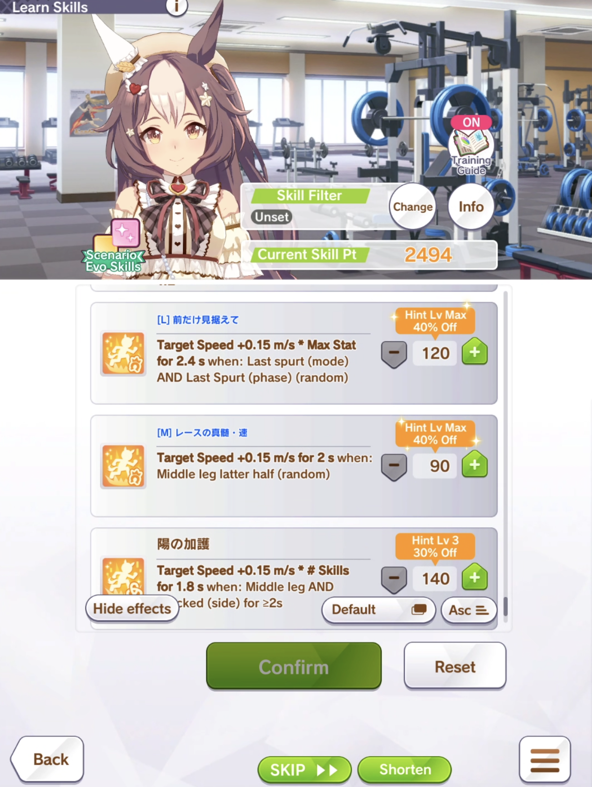
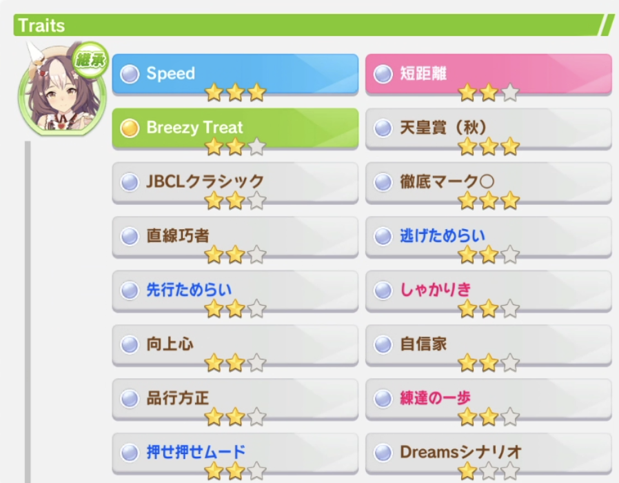

# Hachimi Race Helper (ウマ娘 Skill Visualizer)

This project was created to study **Vibe coding** and help classify skills within **Uma Musume Pretty Derby (ウマ娘)** for players who cannot read Japanese. It enhances the game experience by adding English prefixes that indicate skill activation timing and applying color highlights to differentiate skill priorities.

## 📸 Demo Screenshots




## 🏷️ Prefixes (Skill Activation Timing)

To help you understand when a skill will activate during a race, English prefixes are added before the Japanese skill names:

- **`[E]` (Early Phase):** Skills that activate during the start of the race (Phase 0).
- **`[M]` (Middle Phase):** Skills that activate during the middle of the race (Phase 1, distance traveled >= 50%, or the latter half of the track).
- **`[L]` (Late / Last Spurt):** Skills that activate during the final stages or when accelerating towards the goal (Phase 2 or 3+, or Final Corner).

## 🎨 Skill Color Classification (Colors)

To help prioritize skills for each racehorse, skills are divided into 2 priority levels using color codes:

- **High Priority - Pink/Red (`#ff0066`):** Essential skills that are highly recommended for your build.
- **Normal Priority - Blue (`#0055ff`):** Secondary or standard skills that you plan to use.

### ⚙️ How to Define Colors
You can manage your custom list and categorize skills in the `skill.txt` file:
- To set a skill as **Blue (Normal Priority)**, simply type the skill name, e.g., `右回り`
- To set a skill as **Pink/Red (High Priority)**, add an exclamation mark `!` in front of the name, e.g., `!しゃかりき`

## 🛠️ Installation

### Dependencies:
To run the processing script, ensure that you have the following installed on your system:
1. **`sqlite3`**: Required to extract skill information from the game's `master.mdb` database.
2. **`jq`**: Required to parse and modify the JSON data structure.

### Error Checking (`missing_skills.log`)
After building the dictionary, if any skill listed in `skill.txt` contains a typo or is not found in the game's database, it will be logged into `missing_skills.log` for your review.

## 🚀 How to Use

1. Run the processing script in your Terminal:
   ```bash
   ./build_dict.sh
   ```
2. The script will generate a `text_data_dict.json` file.
3. Take the generated `text_data_dict.json` file and replace the original one located in the path: `..\hachimi\localized_data\` within your client folder.
